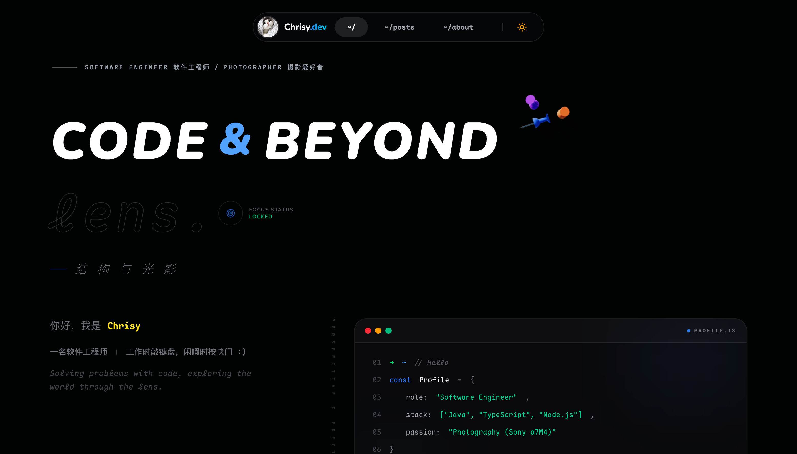

# [chrisy.dev](https://chrisy.dev)

[中文](./README_CN.md)

Hi, I'm Chrisy — a software engineer who writes code and takes photos.

[](https://nextjs.org)
[](https://react.dev)
[](https://tailwindcss.com)
[](https://mdxjs.com)
[](https://pages.cloudflare.com)
[](./LICENSE)



## Tech Stack

| Category         | Stack                              |
|------------------|------------------------------------|
| Framework        | Next.js 16 (App Router)            |
| Content          | MDX                                |
| Styling          | Tailwind CSS v4                    |
| Animation        | Framer Motion                      |
| Syntax Highlight | Shiki                              |
| Fonts            | Nunito + Noto Sans SC + Maple Mono |
| Deployment       | Cloudflare Pages                   |

## Features

- **MDX-powered** — all posts written in `.mdx`, embed custom React components
- **Dark mode** — via next-themes, follows system preference
- **Code blocks** — Shiki syntax highlighting with line numbers, copy button, language label
- **Responsive** — full-width on mobile, pill-shaped header on desktop, auto hamburger toggle
- **Splash screen** — first-visit loading animation
- **Table of contents** — auto-generated from MDX headings
- **Markdown extras** — Callout, tables, highlighted text, and other custom components

## Project Structure

```
content/                  # MDX posts, organized by directory
src/                     
├── app/                  # Next.js App Router pages
│   ├── about/            # About page
│   ├── posts/            # Post list & [...slug] dynamic routes
│   └── layout.tsx        # Root layout (Metadata, Theme, Header, Footer)
├── components/
│   ├── mdx/              # MDX custom components (code, callout, catalog, table...)
│   └── ui/               # Shared UI components (header, footer, hero, theme...)
├── lib/                  # Utilities (posts loader, shiki config, fonts)
├── images/               # Static images
└── styles/               # Global styles
```

## Local Development

```bash
# Install dependencies
npm install

# Start dev server
npm dev

# Build
npm build
```

## Writing Posts

Create a `.mdx` file under `content`. Nested directories are supported. You must `export metadata` or the
build will fail:

```mdx
export const metadata = {
    title: 'Post Title',
    date: '2026-01-01',
    summary: 'A brief summary',
    tags: ['Next.js', 'React'],
    address: 'Shanghai',
}

## Getting Started

Content goes here...
```

| Field     | Required | Description                       |
|-----------|----------|-----------------------------------|
| `title`   | Yes      | Post title                        |
| `date`    | Yes      | Publish date, format `YYYY-MM-DD` |
| `summary` | No       | Brief description                 |
| `tags`    | No       | Array of tags                     |
| `address` | No       | Where it was written              |

Available custom components: `<Callout>`, `<Catalog>`, `<Code>`, `<Highlight>`, `<Article>`, `<Table>`, and more.

## Deployment

Hosted on [Cloudflare Pages](https://pages.cloudflare.com), auto-deployed via Git.

## License

MIT
